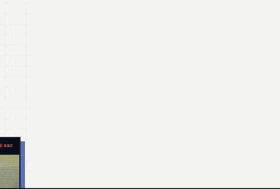

<div align="center">

# Victor Elias

### Full-stack Developer · Interfaces, products and digital experiences

I build responsive web applications with a strong eye for design,<br>
turning ideas into clear, intuitive and enjoyable experiences.

[](https://vefolio.netlify.app/)
[](mailto:victorsle013@gmail.com)
[](https://github.com/victoregit)

<br>

<a href="https://vefolio.netlify.app/">
  
</a>

</div>

## About me

I'm a full-stack developer who enjoys working where **code, interface and design** meet. I care about the details that make a product feel polished—from a solid implementation to a simple, accessible user experience.

- Building responsive interfaces and full-stack web experiences
- Deepening my knowledge of **Java** and **Angular**
- Open to collaborating on thoughtful products and creative projects

## Tech stack

<div align="left">
  
</div>

## What I value

```text
Clean interfaces  ·  Thoughtful details  ·  Continuous learning  ·  Good collaboration
```

## Let's connect

Want to discuss a project, an opportunity or exchange ideas? Visit my [portfolio](https://vefolio.netlify.app/) or send me an [email](mailto:victorsle013@gmail.com).

<div align="center">

<sub>Designed and built with care by Victor Elias.</sub>

</div>
